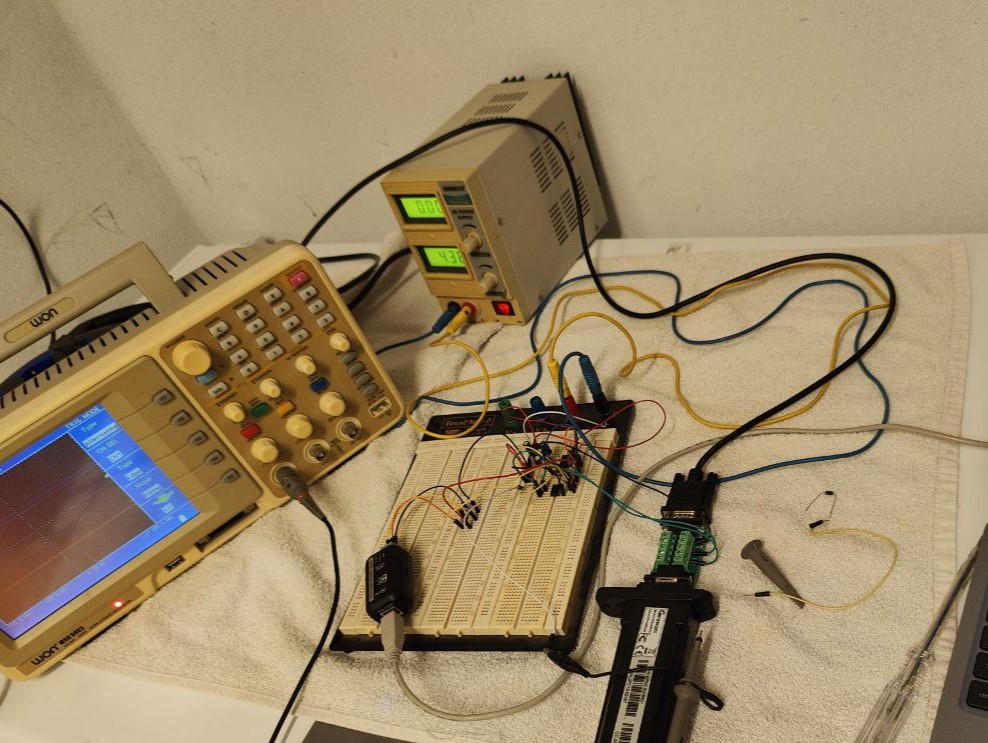

# Growatt SPH Inverter Communication Sniffer

## Project Overview

This project aims to develop a custom hardware interface and software system for reading and interpreting communication data from a **Growatt SPH series inverter**. The system intercepts the communication between the inverter and the official **ShineWiFi-S dongle**, using signal conversion and a **Raspberry Pi** to capture and decode the **Modbus RTU protocol** used by Growatt.
  
 
   
## System Architecture

The solution is composed of the following main stages:

1. **Sniffing the RS-232 Communication**  
   The inverter and ShineWiFi-S dongle communicate over an **RS-232 serial connection**. This project taps into that communication without interfering with the normal operation of either device.

2. **RS-232 to TTL Conversion**  
   Because RS-232 voltage levels are not directly compatible with most microcontrollers or logic analyzers, the tapped signal is first converted to **TTL level signals** using an RS-232 to TTL converter module (MAX232).

3. **TTL to RS-485 Conversion**  
   To ensure signal integrity over longer distances and allow for differential signaling, the TTL signal is then converted to **RS-485** using a TTL to RS-485 transceiver (MAX485).

4. **Data Acquisition via Raspberry Pi**  
   The RS-485 output is connected to a **Raspberry Pi**, which acts as the main controller. The Raspberry Pi receives the data through its serial interface.

5. **Modbus Decoding and Data Interpretation**  
   A **Python script** running on the Raspberry Pi listens to the serial port, decodes the Modbus RTU frames, and extracts relevant data such as:

   - Inverter status
   - Power production
   - Battery charge/discharge
   - Grid voltage and frequency
   - And other available telemetry

## Hardware Components

- Growatt SPH series inverter
- ShineWiFi-S dongle (OEM)
- Breakout DB9
- Raspberry Pi (any model with UART support)
- Optional: Logic level shifters and protective diodes

## Key Advantages

- **Non-intrusive monitoring** of Growatt inverter communication
- **Real-time access** to detailed inverter data
- Enables custom logging, alerting, or integration with home automation platforms (e.g., Home Assistant)

## Disclaimer

This project involves tapping into proprietary communication and working with high voltages indirectly. **Ensure all safety precautions are followed** and use this project at your own risk. This is intended for **educational and personal use only**.
